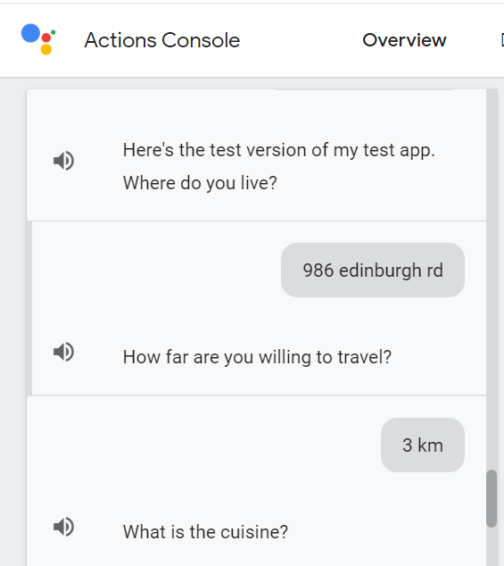
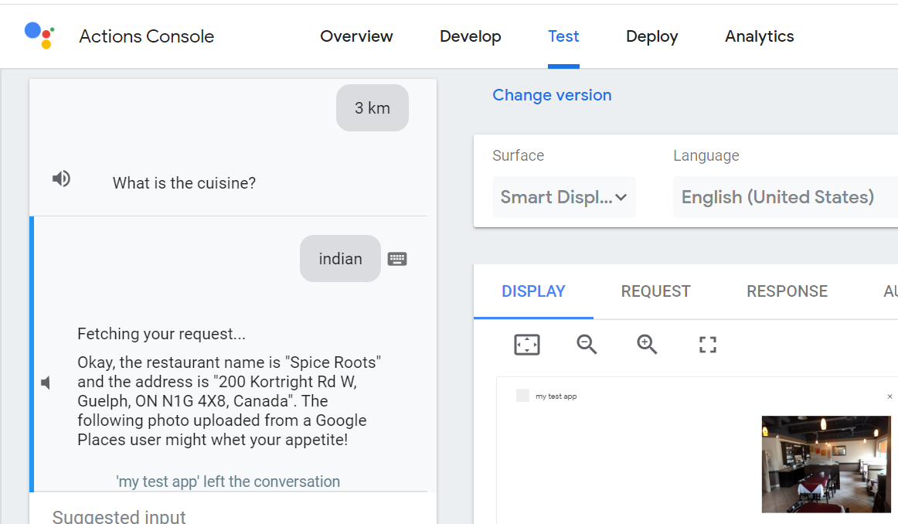
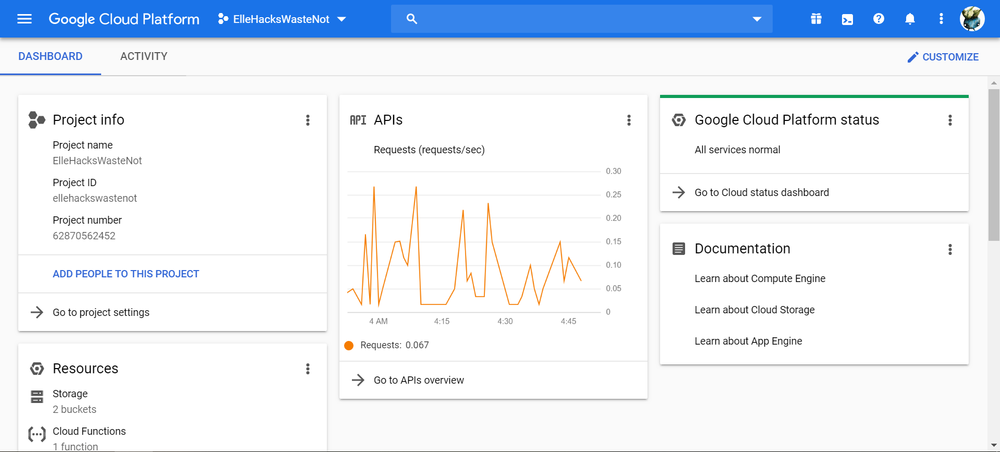

# WasteNotRestaurantLocator

This is the code for the WasteNot Google assistant feature that will help users of the application choose the most environmentally conscious restaurant in which to dine.

First, the assistant asks your location so that you can find a restaurant near you so as to minimize travel time and its subsequent pollution:

Nest, it asks you how far away you're willing to go:

Finally, the system asks you what kind of food you're craving:

The system then queries the Google Places ID API and the Google Geocodes API to get the information about nearby establishments and determine whether isn't a place worth visiting- I show a picture- and a meal worth having!